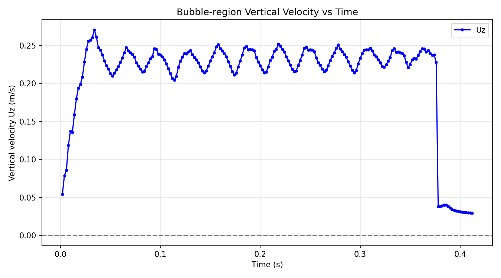

# OpenFOAM Air Bubble Rising Simulation

A 2D/3D multiphase CFD simulation modeling the dynamics of an air bubble rising through water in an open container using OpenFOAM's `interFoam` solver. The project includes automated Python post-processing scripts to track, calculate, and plot the phase-weighted vertical velocity of the rising bubble over time.

---

##  Project Overview

* **Solver:** `interFoam` (Volume of Fluid - VOF method for two immiscible, incompressible fluids)
* **Phases:** Air (dispersed bubble phase) and Water (continuous medium)
* **Post-Processing:** Python 3 (`numpy`, `matplotlib`, `argparse`)
* **Velocity Calculation:** Volume-weighted phase fraction average:

$$U_z = \frac{\sum (\alpha_{\text{air}} \cdot U_z \cdot V_{\text{cell}})}{\sum (\alpha_{\text{air}} \cdot V_{\text{cell}})}$$

---

##  Results & Velocity Profile



### Velocity Curve Analysis

1. **Initial Acceleration Phase ($0.00\text{ s} - 0.04\text{ s}$):**
   * **Behavior:** The velocity rapidly ramps up from $0.05\text{ m/s}$ to a peak near $0.27\text{ m/s}$.
   * **Physics:** Immediately upon release, net buoyancy force ($F_B$) dominates over initial hydrodynamic drag ($F_D$), causing high upward acceleration.

2. **Quasi-Steady Terminal Velocity Phase ($0.04\text{ s} - 0.38\text{ s}$):**
   * **Behavior:** The bubble enters dynamic equilibrium, oscillating around a mean velocity of **$\sim 0.23 - 0.24\text{ m/s}$**.
   * **Physics:** Forces reach dynamic balance ($\Sigma F_z \approx 0$). Oscillations are driven by periodic bubble shape deformation (spherical to oblate ellipsoid) and vortex shedding in the wake, which continuously fluctuates the drag coefficient ($C_D$).

3. **Free Surface Breakthrough ($t \approx 0.38\text{ s}$):**
   * **Behavior:** Sharp velocity drop down to $\sim 0.03\text{ m/s}$.
   * **Physics:** The bubble breaches the open fluid surface at the top of the container, rupturing the liquid film and dissipating into the atmosphere.

### Comparison to Theoretical Models

For a millimeter-scale air bubble in water ($D \approx 2 - 4\text{ mm}$), analytical correlations (**Mendelson's wave theory** & **Grace Diagram**) predict a terminal rising velocity plateauing between **$0.20\text{ m/s}$ and $0.25\text{ m/s}$**. The simulated average terminal velocity of **$\sim 0.23\text{ m/s}$** closely matches theoretical expectations, validating the computational model.

---

##  Repository Structure

```text
├── 0/                        # Initial and boundary conditions
├── constant/                 # Physical & transport properties (g, phaseProperties)
├── system/                   # Numerical schemes, solvers, and controlDict
├── Allrun                    # Automated shell execution script
├── bubble_velocity_plot.py   # Python script to parse data and generate plots
├── bubble_velocity.csv       # Extracted time-series data
├── create_alpha_air.py       # Generate alpha.air for every time step
└── README.md                 # Project documentation
